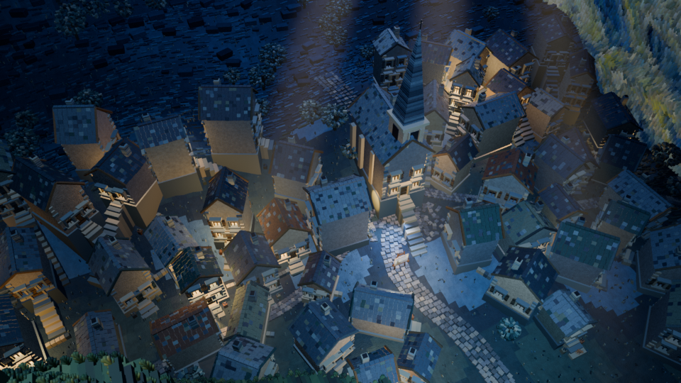
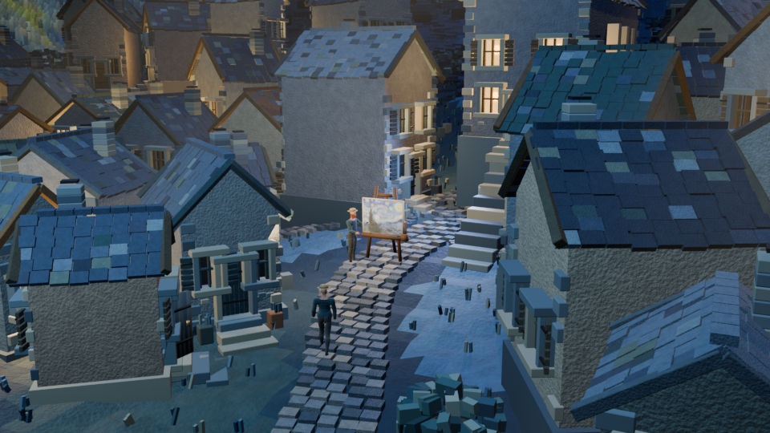
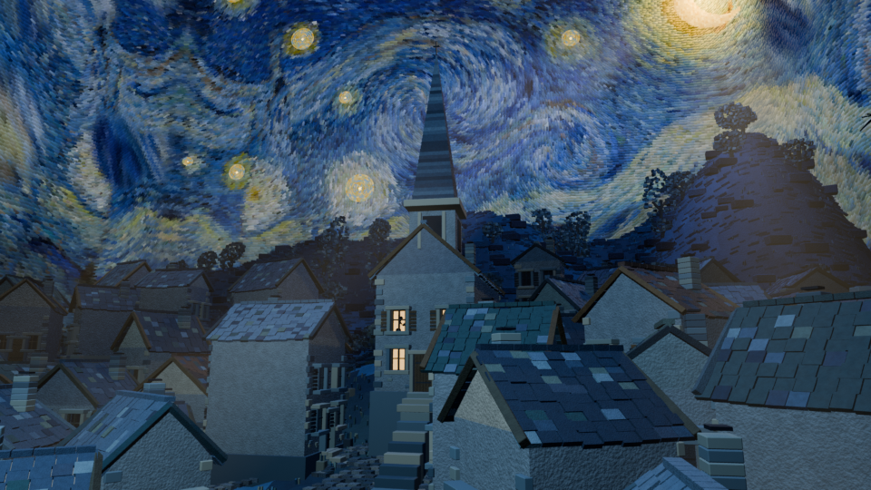

# La Nuit étoilée — modèles Blender

Les scènes 3D de **La Nuit étoilée**, inspirées de Vincent van Gogh, dans la **version V7 utilisée pour le projet final**. Village, ciel peint en volume, cyprès, reliefs, habitants, hirondelles, accessoires et éclairages sont réunis dans un fichier Blender modifiable.

**[Télécharger le projet Blender complet](https://github.com/Firisis971/van-gogh-blender/releases/latest)** · [Guide Blender](docs/GUIDE_BLENDER.md) · [Crédits](CREDITS.md)

## Télécharger et ouvrir

1. Dans **Releases**, télécharger **La_Nuit_Etoilee_V7_Blender.zip**.
2. Décompresser l'archive.
3. Ouvrir `blender/La_Nuit_Etoilee_V7.blend` avec **Blender 5.0 ou une version compatible**. La version vérifiée est Blender **5.0.0**.

Les textures nécessaires sont intégrées au `.blend`. Aucune extension tierce, bibliothèque Blender externe, musique ou séquence d'images n'est nécessaire.

> Le bouton **Code → Download ZIP** télécharge la documentation et les scripts. Le **fichier Blender complet se trouve dans Releases**, car il dépasse la limite d'un fichier Git classique.

## Contenu

| Scène Blender | Éléments disponibles | Animation |
|---|---|---|
| **09 · PROMENADE — Regards dans la nuit** | Village, relief, cyprès, lune, étoiles, cadre, personnages, objets de rue, caméras et lumières | Plage 1–1440 ; ouverture sur l'image 684 |
| **10 · LES HEURES — Depuis la rue** | Village et cycle des éclairages | Images 745–984 |
| **13 · LA NUIT RESPIRE — Fenêtre et hirondelle** | Personnage de profil aux deux fenêtres, accessoires, masques de fenêtres et hirondelle | Images 1–144 |

Le fichier contient **750 objets**, **473 données de maillage**, **675 matériaux**, **13 armatures** et **220 blocs d'animation**. Ces totaux comprennent les variantes nécessaires aux trois scènes et les données conservées du fichier source ; il ne s'agit pas de 750 modèles uniques.

Les matériaux procéduraux, modificateurs, rigs, poses animées, caméras, lumières, mondes et réglages de compositing sont conservés. Les animations de visibilité restent actives : certains personnages sont volontairement masqués selon l'image choisie.

| Personnages et accessoires | Vie aux fenêtres |
|---|---|
|  |  |

## Périmètre de cette publication

Cette publication contient les **modèles et les scènes Blender de la V7 uniquement**. Le film, les fichiers MP4, la musique, les sons, les séquences d'images et le montage du séquenceur ne sont pas distribués. Les images ci-dessus sont des aperçus fixes rendus depuis le fichier partagé.

Les anciennes versions ne sont pas incluses. Les noms historiques des objets et collections sont conservés pour faciliter leur repérage.

## Réutiliser un élément

Depuis un autre projet Blender, utiliser **Fichier → Ajouter (Append)**, sélectionner le `.blend`, puis **Collection** ou **Object**. Pour un personnage animé, importer sa collection avec son armature et ses accessoires. Voir le [guide détaillé](docs/GUIDE_BLENDER.md).

## Vérification et scripts

- [Rapport de vérification](docs/verification.json) : inventaire, absence de dépendances externes, de sons et de séquenceur, évaluation de onze images représentatives des animations.
- `scripts/prepare_blender.py` : préparation d'une copie 3D depuis le fichier V7 d'origine ; chemins source et destination fournis en arguments.
- `scripts/verify_blender.py` : contrôle du fichier partagé dans Blender.
- `scripts/render_previews.py` : rendu des trois aperçus fixes.

Les scripts sont facultatifs : le fichier Blender s'ouvre directement. Le script de préparation nécessite le fichier original, qui n'est pas distribué puisqu'il contient le montage.

## Crédits et réutilisation

Voir [CREDITS.md](CREDITS.md) pour Van Gogh et les bases anatomiques MakeHuman. Les licences des éléments tiers restent applicables à ces éléments. Aucune licence générale de réutilisation n'est attribuée aux créations propres à ce projet dans cette publication ; contacter [Firisis971](https://github.com/Firisis971) pour les autorisations.
